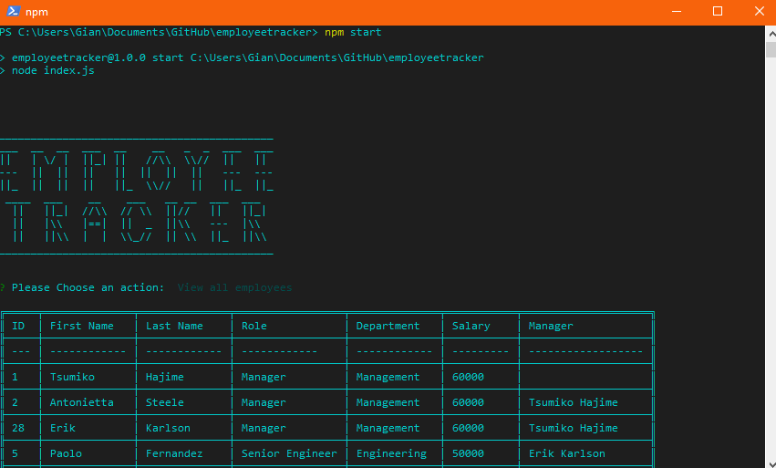

# Employee Tracker

www.github.com/rebgrasshopper/employeetracker

Table Of Contents:

- [Section 1: Introduction](#introduction)
- [Section 2: Installation](#installation)
- [Section 3: Usage](#usage)
- [Section 4: License](#license)
- [Section 5: Credits](#credits)
- [Section 6: Tests](#tests)

## Introduction:

This project is a command line interface program running in Node.js. It uses a MySQL database to organize employee and department data, and offers the ability to edit that data through the terminal. It uses inquirer.js to interact with user input.

Walkthrough:

## Installation:

To install this project, download the source files from github, and access the folder via your terminal/console of choice. Run npm i to install dependencies (inquirer, mysql, and table), and then use npm start to begin the program.

## Usage:

You are free to use the code for any project you wish within the limits of the GNU License. You can access it via downloading files directly from github or forking the repo for your own use.

## License:

GNU General Public License v3.0

## Credits:

Thanks for tips and/or inspiration

- [Clyde Baron Rapinan](https://github.com/clydebaron2000)
-  [Elliott Jones](https://github.com/JonesElliott)

## Tests:

Tests for the JavaScript classes can be found in /tests, and run using npm test.

## Questions: 

You can contact me with questions via:
- [Email](rellwoos@gmail.com)
- [GitHub](https://www.github.com/rebgrasshopper)
- [LinkedIn](https://www.linkedin.com/in/plover-brown-37b6981a5)
